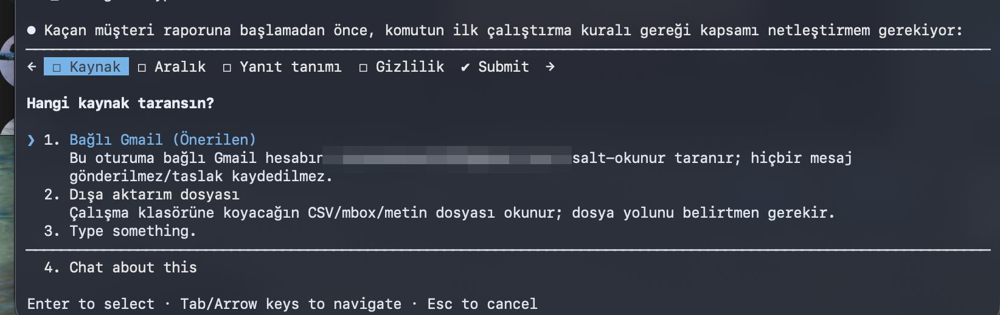

# Digiens Claude Paketi 🇹🇷

**Claude Code için Türkçe işletme kurulumu.** İki komutla kur; işletmeni yöneten komutlar ve uzman ajanlarla çalışmaya başla. Girişimciler ve işletme sahipleri için tasarlandı — kod bilmek şart değil.

## Hızlı kurulum

```bash
# 1. Marketi ekle
/plugin marketplace add MECoban/digiens-claude-paketi

# 2. Paketi kur — sorulduğunda "Install for you (user scope)" seç
/plugin install digiens-claude-paketi
```

> **Komutları çağırma:** Komutlar `/digiens-claude-paketi:komut-adi` olarak kaydolur. Ezberlemene gerek yok — `/` yazıp komut adının başını yaz (ör. `/kacan`), menüden seç. Kurulumdan sonra komutları görmüyorsan oturumu yeniden başlat.

Detaylı adımlar için: [HIZLI-BASLANGIC.md](HIZLI-BASLANGIC.md)

## Her rapor üç soruyla başlar

Paketin çıktı standardı: hangi komutu çalıştırırsan çalıştır, raporun ilk satırları günlük dille üç soruyu cevaplar — **Ne buldum? · Bu ne demek? · Şimdi ne yapmalısın?** Detay tabloları sonra gelir; ilk üç satırı okuyan herkes ne olduğunu anlar.

## Güvenlik nasıl görünüyor?

Komutlar bir şeye dokunmadan önce kapsamını sana sorar — ekran gerçek kullanımdan:



*"Salt-okunur taranır; hiçbir mesaj gönderilmez/taslak kaydedilmez" — imza her zaman sende.*

## İçinde ne var?

### 💼 İşletme Komutları (5) — paketimizin kalbi
| Komut | Ne yapar |
|---|---|
| `/7-disli-rontgen` | İşletmenin 7 dişlisini (pazarlama, satış, operasyon, ürün, yönetim, finans, İK) tarar; en çok para kaçıran dişliyi teşhis eder |
| `/kacan-musteri` | Cevapsız kalan müşterileri bulur, tablolar, onayına sunulacak takip taslakları hazırlar — **asla kendisi göndermez** |
| `/sabah-brifingi` | Günün programı + cevap bekleyenler + günün 3 önceliği, tek sayfada |
| `/teklif-hazirla` | İşletme bilgin ve şablonunla dakikada tutarlı teklif TASLAĞI (metin; tasarımlı PDF değil) |
| `/hafizaya-isle` | Oturumdaki düzeltmelerini kalıcılaştırır — dijital çalışanın seninle birlikte ustalaşır |

### 🤖 Uzman Ajanlar (12)
**İşletme:** `donusum-denetcisi` — siteni müşteri gözüyle inceler, satış engellerini işletme diliyle raporlar.
**Mimari & planlama:** `sistem-mimari` · `backend-mimari` · `frontend-mimari` · `gereksinim-analisti` · `teknoloji-secici`
**Kalite & performans:** `kod-sadelestirici` · `performans-uzmani` · `guvenlik-uzmani`
**Doküman & araştırma:** `teknik-yazar` · `ogrenme-rehberi` · `derin-arastirmaci`

### 🛠 Geliştirme Komutları (14)
Geliştirme: `/yeni-gorev` · `/kod-acikla` · `/kod-hizlandir` · `/kod-temizle` · `/ozellik-plani` · `/lint-duzelt` · `/dokuman-uret`
API: `/yeni-api` · `/api-test` · `/api-koru` — UI: `/yeni-component` · `/yeni-sayfa` — Supabase: `/tip-uret` · `/yeni-edge-function`

### 🔌 MCP Sunucuları
- **Context7** — güncel dokümantasyon: prompt'una `use context7` yaz, Claude en güncel bilgiyle çalışsın
- **Playwright** — tarayıcı otomasyonu (dönüşüm denetçisinin gözü)

Detaylar: [MCP-SUNUCULARI.md](MCP-SUNUCULARI.md) — ⚠️ Bu sunucular kurulmadan ilgili özellikler (güncel doküman çekme, tarayıcı denetimi) çalışmaz; kurulum adımları dosyada.

## Nasıl başlamalı? (önerilen sıra)

1. Kur → `CLAUDE.md` dosyana işletmeni tanıt (2 dakika sesli anlatım yeter — "işletmemi anlatacağım, CLAUDE.md'ye işle" de)
2. `/7-disli-rontgen` — işletmenin fotoğrafını çek
3. Röntgenin işaret ettiği yerden başla — çoğu zaman `/kacan-musteri`
4. Her sabah `/sabah-brifingi`; işe yaradığını görünce zamanlanmış rutine bağla
5. Haftada bir `/hafizaya-isle` — Claude'un seni her hafta daha iyi tanısın

## Önerilen ekler

- **[claude-mem](https://github.com/thedotmack/claude-mem)** — oturumlar arası süper hafıza (çok popüler topluluk eklentisi, [Türkçe README](https://github.com/thedotmack/claude-mem/blob/main/docs/i18n/README.tr.md) mevcut). Hafıza özelliğini bir üst seviyeye taşımak isteyenlere.
- **[Anthropic Claude Cookbooks](https://github.com/anthropics/claude-cookbooks)** — resmî örnek ve desen kütüphanesi (MIT). Derinleşmek isteyenlere.

## Teşekkür ve kaynak

Bu paketin yapısı ve geliştirme komutları, [Edmund Yong'un edmunds-claude-code](https://github.com/edmund-io/edmunds-claude-code) paketi (MIT) temel alınarak Türkçeye uyarlanmış ve işletme katmanıyla genişletilmiştir. Teşekkürler Edmund! 🙏

## Lisans

MIT — [Digiens AI](https://digiens.com) tarafından hazırlanmıştır.

---

> **Güvenlik ilkesi:** Bu paketteki hiçbir komut senin onayın olmadan e-posta göndermez, veri silmez, geri alınamaz iş yapmaz. Taslak hazırlar, rapor çıkarır — **imza her zaman sende.** Müşteri verisiyle çalışırken KVKK yükümlülüklerin geçerlidir; başkasının verisini izinsiz hiçbir sisteme bağlama.
